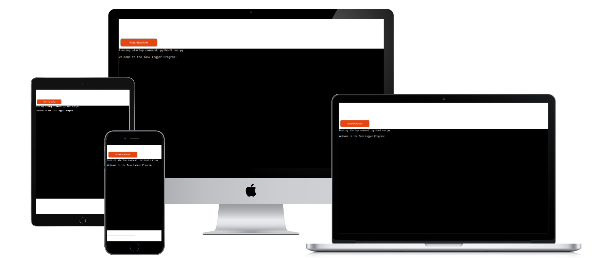
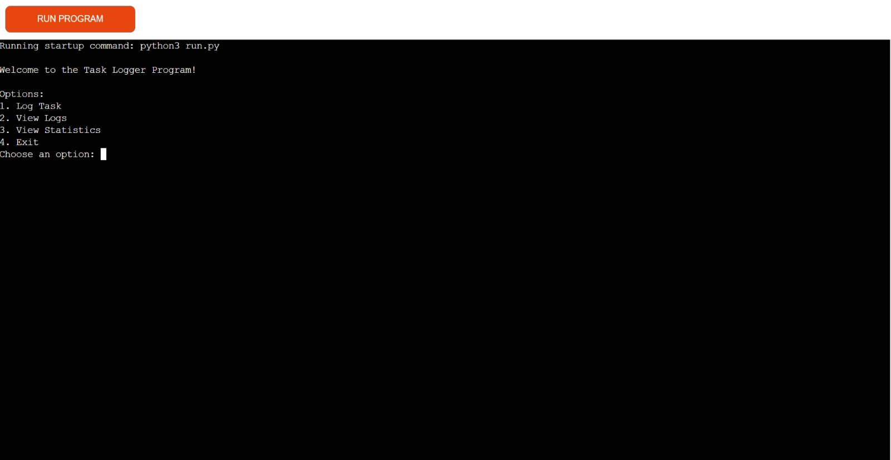
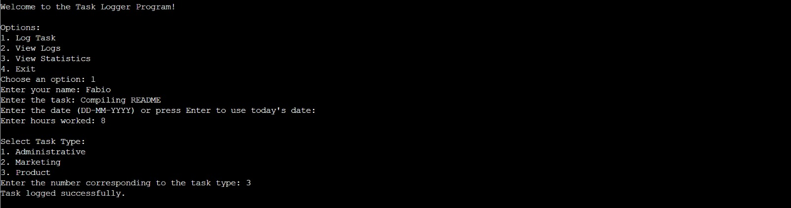
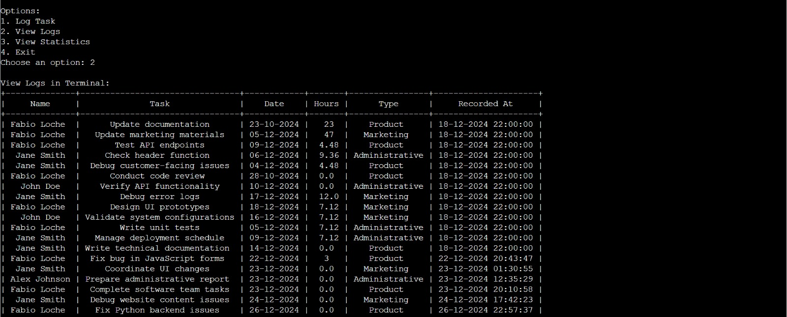
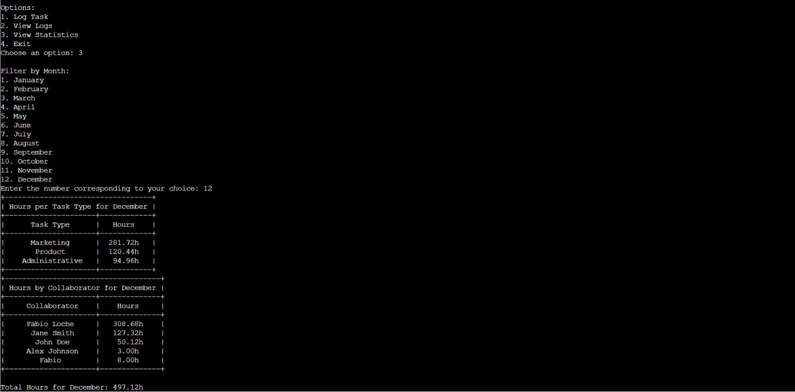

# Collaborator Tracker

Collaborator Tracker is a Python program designed to help users efficiently log, view, and analyze tasks using a Google Sheets backend. The program integrates task management and data visualization features, offering a simple yet effective solution for individuals and teams.
This tool empowers managers to observe tasks completed by each team member, monitor hours worked, and review detailed monthly statistics for both individual contributors and the team collectively. Thanks to the efficient interface, team members can rapidly log tasks in under 30 seconds. The data gathered offers real-time insights that enable managers to improve team productivity and performance.




---

## Table of Contents
1. [Project Overview](#project-overview)
2. [Live Application](#live-application)
3. [Features](#features)
4. [Program Flow](#Program-flow)
4. [Project Structure](#project-structure)
5. [Setup](#setup)
   - [Setup instructions](#Setup-instructions)
   - [Dependencies](#dependencies)
   - [Google Sheets API Setup](#google-sheets-api-setup)
   - [Environment Variables](#environment-variables)
   - [Configurations](#configurations)
6. [Testing](#testing)
   - [Functionality test results](#Functionality-test-results)
   - [Performance Testing](#performance-testing)
   - [Browser Compatibility Testing](#browser-compatibility-testing)
7. [Deployment on Heroku](#Deployment-on-Heroku)
8. [Cloning the Repository](#cloning-the-repository)
9. [Contributors](#contributors)

---

## Project Overview

This tool enables managers to view tasks performed by each team member, track hours spent, and access detailed monthly statistics for the entire team or individual members. Team members can quickly log tasks in under 30 seconds, thanks to our efficient interface. These statistics provide real-time insights that help managers enhance team productivity and performance. 
Collaborator Tracker aims to simplify task tracking and management by providing:
- A command-line interface for logging tasks.
- Google Sheets integration for real-time data storage and retrieval.
- Data filtering and statistical analysis for better task insights.

---

## Live Application

Access the live application here: [Collaborator Tracker](https://fabioapptest-71025b7099dc.herokuapp.com/)


---

## Features

- *Task Logging:* Easily log task details such as type, assignee, date, and hours worked.
- *Data Viewing:* Retrieve and display task logs in a tabular format.
- *Filtering by Month:* Filter tasks by specific months for focused reviews.
- *Statistical Analysis:* View detailed statistics, including total hours spent per task type and collaborator.
- *Google Sheets Integration:* Interact with Google Sheets for seamless data handling.

---

## Program Flow

1. The user is welcomed with the **Main Menu Screen**.
2. They can choose to:
   - Log a new task.
   - View all logged tasks.
   - Display statistics for specific months.
   - Exit the program.
3. Tasks are saved to a Google Sheet, and data is retrieved for viewing logs and statistics.

---

## Project Structure

### Key Files
- *run.py*: Main program script.
- *requirements.txt*: Lists Python dependencies.
- *Google Sheets Credentials*: JSON file for API authentication.

### Screens

1. **Main Menu Screen**: The central hub where users can select options to log tasks, view logs, or display statistics.  

   

2. **Task Logging Screen**: Interface for entering task details, including name, task description, date, hours, and type.  

   

3. **View Logs Screen**: Displays all logged tasks in a table format for review.  

   

4. **Statistics Screen**: Summarizes logged tasks by hours, task type, and collaborator, filtered by month.  

   

---

## Setup

### Setup Instructions

1. Create a Google Cloud project and enable the Google Sheets API.
2. Download the service account JSON key file and set it as the `creds` environment variable.
3. Update the `SPREADSHEET_ID` and `SHEET_NAME` variables in the script.
4. Run the program using Python.

### Dependencies
- *Python*
- *Libraries:*
  - gspread: For interacting with Google Sheets.
  - google-auth: For authenticating with Google APIs.
  - prettytable: For creating formatted tables.

### Google Sheets API Setup
1. Enable the *Google Sheets API* in the Google Cloud Console.
2. Create a service account and download the credentials as a JSON file.
3. Save the credentials in a secure location and ensure the path is accessible by your program.

### Environment Variables
Set up the following environment variable:
- CREDS: Path to your Google Sheets API JSON credentials.

### Configurations
Modify the script with your Google Sheets details:
- SPREADSHEET_ID: The ID of your spreadsheet.
- SHEET_NAME: The name of the worksheet to use.

---

## Testing

The project includes extensive testing to ensure reliability and performance. Below is an outline of the tests performed, their objectives, and outcomes.


### Functionality test results

| **Feature**                   | **Expected Outcome**                                             | **Testing Performed**                                | **Result**                                      | **Pass/Fail** |
|--------------------------------|------------------------------------------------------------------|-----------------------------------------------------|------------------------------------------------|---------------|
| **Log Task**                   | Logs a task entry with all required fields                       | Entered task details and verified in the sheet      | Task details were appended correctly           | Pass          |
| **View Logs**                  | Displays all tasks in a formatted table                         | Called function to fetch and display tasks          | Tasks displayed in `PrettyTable` format        | Pass          |
| **Filter Tasks by Month**      | Filters tasks based on the user-selected month                  | Selected a specific month and reviewed filtered tasks | Filtered tasks displayed accurately            | Pass          |
| **Display Statistics Table**   | Displays task statistics by type, collaborator, and total hours | Generated summary tables for a specific month       | Statistics displayed accurately                | Pass          |
| **Date Validation**            | Validates and formats user-entered date                        | Entered valid/invalid dates in different formats     | Accepted valid dates, rejected invalid dates   | Pass          |
| **Task Type Selection**        | Allows user to select a task type from a menu                   | Selected options (1, 2, 3) and verified type returned | Correct task type returned for each choice     | Pass          |
| **Statistics Calculation**     | Summarizes total hours by task type and collaborator            | Entered test data and reviewed generated statistics | Accurate summary calculations                  | Pass          |
| **User Menu Navigation**       | Displays the menu and executes chosen options                   | Selected all menu options (1-4)                     | All options performed expected actions         | Pass          |
| **Exit Program**               | Terminates the script when the user selects "Exit"              | Selected "Exit" from the menu                       | Program terminated without errors              | Pass          |
| **Error Handling**             | Displays meaningful error messages for unexpected issues        | Simulated errors (e.g., connection issues, input errors) | Errors were caught and displayed appropriately | Pass          |
| **Responsiveness**             | Adapts to various user inputs and handles invalid data gracefully | Entered invalid inputs for different features       | Script handled invalid inputs without crashing | Pass          |


### Types of Tests

#### Performance Testing
- **Objective:** To ensure the application remains performant under heavy use.
- Example:
  - Tested with a dataset containing over 200 task entries, ensuring consistent responsiveness.

#### Browser Compatibility Testing
- **Objective:** To verify the app functions as expected on different web browsers.
- Browsers Tested:
  - **Google Chrome**
  - **Mozilla Firefox**
  - **Microsoft Edge**
  - **Safari**
- Results:
  - The app is fully functional and responsive across all tested browsers.

---

## Deployment on Heroku

1. **Add Buildpacks:**
   - Go to the **Settings** tab of your Heroku app.
   - In the **Buildpacks** section, add:
     - `heroku/python`
     - `heroku/nodejs`
   - Ensure `heroku/python` is listed first.

2. **Set Environment Variables:**
   - In the **Config Vars** section under the **Settings** tab, add the following:
     - **`CREDS`**: Paste your Google Sheets API JSON credentials.
     - **`PORT`**: Set the value to `8000`.

3. **Connect to GitHub:**
   - Go to the **Deploy** tab in your Heroku app.
   - Under **Deployment Method**, select **GitHub** and link your repository.

4. **Select and Deploy Branch:**
   - Choose the branch you want to deploy (e.g., `main`).
   - Click **Deploy Branch** to build and deploy the app.

---

## Cloning the Repository

To clone the repository to your local machine:

1. Log in (or sign up) to GitHub.
2. Go to the repository: fabioeloche/CollaboratorTracker
3. Click on the Code button, select the cloning method (HTTPS, SSH, or GitHub CLI), and copy the link provided.
4. Open your terminal and navigate to the directory where you want to clone the repository.
5. Type the following command into the terminal:
    ```bash
    git clone <https://github.com/fabioeloche/CollaboratorTracker>
---


## Contributors

- [Fabio Loche](https://github.com/fabioeloche) - Project Author

---
